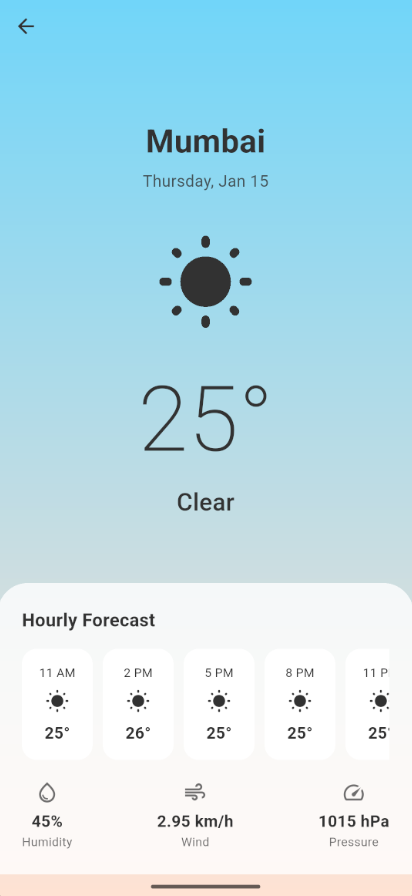
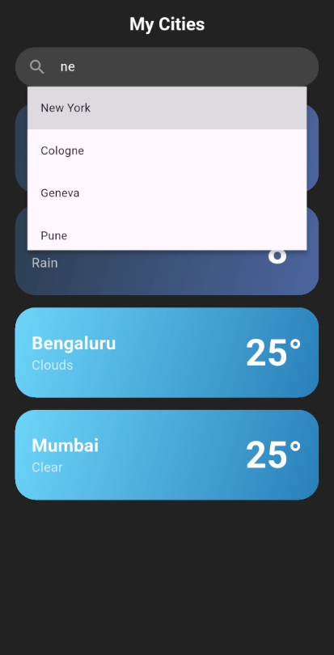
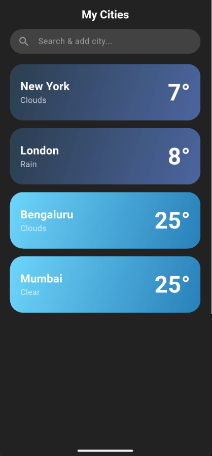

# ☁️ Flutter Weather Forecast App

A beautiful, modern weather application built with Flutter that provides real-time weather data and hourly forecasts. Features dynamic day/night themes, city search with autocomplete, and local data persistence.

<p align="center">
  
</p>

## ✨ Features

* **Real-time Weather:** Fetches current temperature, humidity, wind speed, and pressure.
* **Hourly Forecast:** Horizontal scroll view for the next 24 hours.
* **Smart Search:** Autocomplete search for major world cities.
* **Multiple Cities:** Save your favorite cities to a local list (Swipe to delete).
* **Dynamic UI:** Background gradients and text colors change based on day/night cycles.
* **Secure:** API keys are secured using `.env` file configuration.

## 📸 App Screenshots

| Smart Search | Saved Cities | Weather Details |
|:---:|:---:|:---:|
|  |  |  |
| *Autocomplete suggestions* | *Swipe-to-delete saved list* | *Dynamic gradient UI* |

## 🛠️ Tech Stack

* **Framework:** Flutter (Dart)
* **State Management:** `setState` (Clean & Simple)
* **Networking:** `http` package
* **Location:** `geolocator`
* **Local Storage:** `shared_preferences`
* **Environment Security:** `flutter_dotenv`

## 🚀 Getting Started

This project uses **OpenWeatherMap API**. To run this locally, you need your own API key.

### Prerequisites

* Flutter SDK installed
* An IDE (VS Code or Android Studio)

### Installation

1.  **Clone the repository**
    ```bash
    git clone [https://github.com/YOUR_USERNAME/flutter_weather_app.git](https://github.com/YOUR_USERNAME/flutter_weather_app.git)
    cd flutter_weather_app
    ```

2.  **Install Dependencies**
    ```bash
    flutter pub get
    ```

3.  **🔑 Configure API Key (Important!)**
    Since the API key is secured, you must create a local environment file:
    
    * Create a file named `.env` in the root directory (same level as `pubspec.yaml`).
    * Add your OpenWeatherMap API key inside:
        ```env
        OPENWEATHER_API_KEY=your_actual_api_key_here
        ```

4.  **Run the App**
    ```bash
    flutter run
    ```

## 🤝 Contributing

Contributions are welcome! Feel free to open an issue or submit a pull request.

1. Fork the Project
2. Create your Feature Branch (`git checkout -b feature/AmazingFeature`)
3. Commit your Changes (`git commit -m 'Add some AmazingFeature'`)
4. Push to the Branch (`git push origin feature/AmazingFeature`)
5. Open a Pull Request

## 📫 Connect with Me

* **LinkedIn:** [Krish Jain](https://www.linkedin.com/in/krishj7725/)
* **GitHub:** [krishj7725](https://github.com/krishj7725)
* **Email:** [Krish Jain](krishjain7725@gmail.com)
